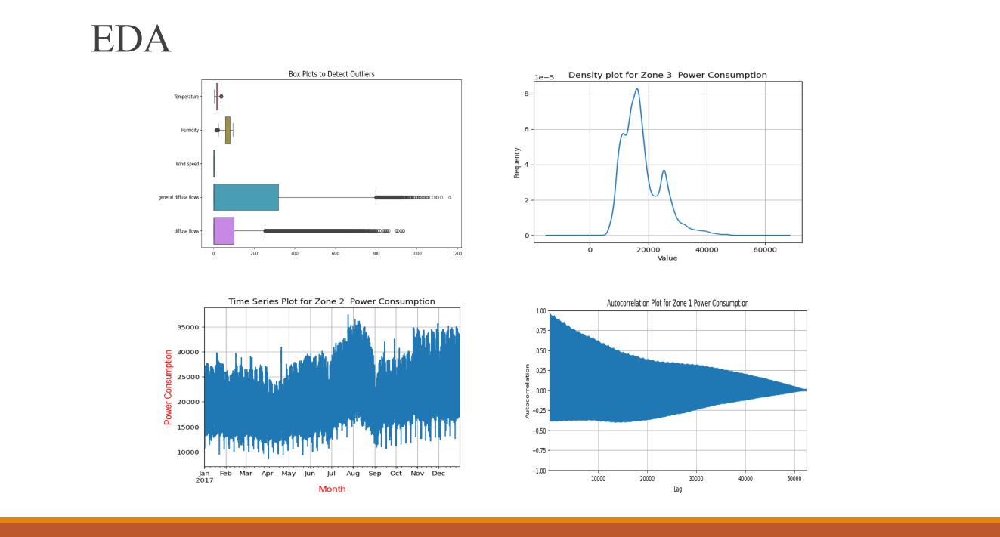
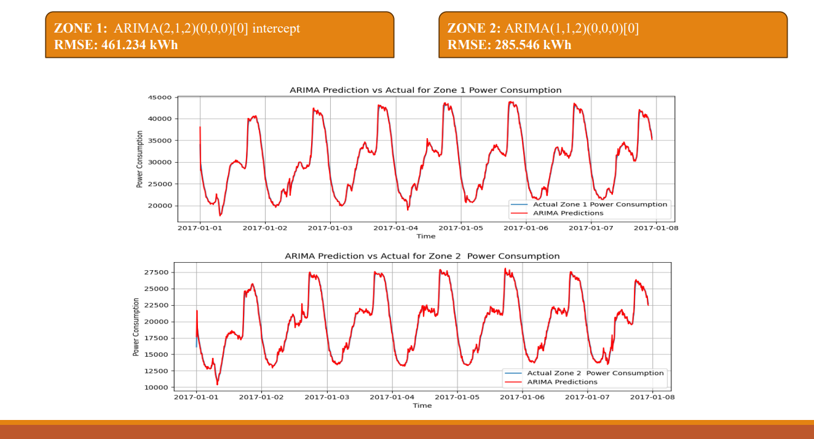
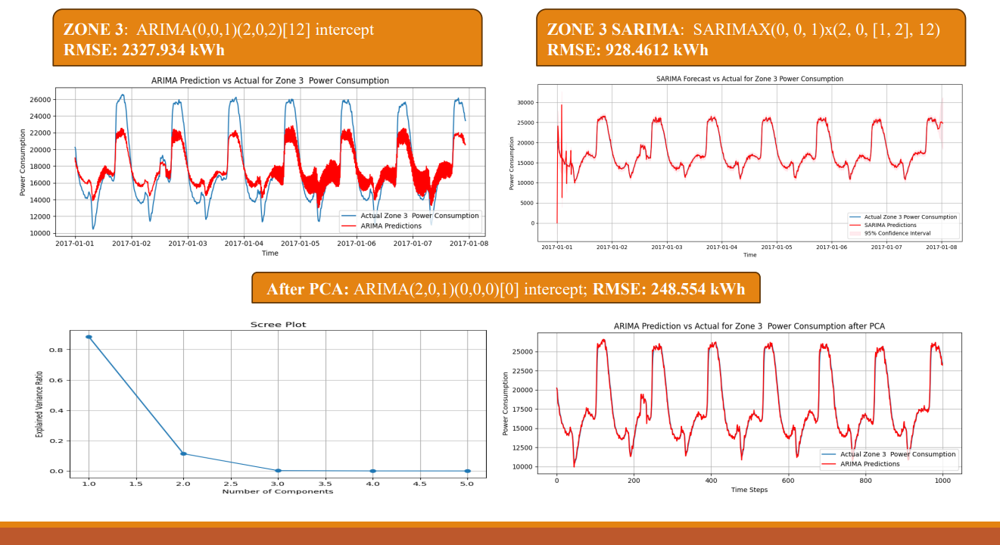

# ⚡ Power Consumption Forecasting

This project focuses on forecasting power consumption across three energy zones in Tetouan City, Morocco using classical time series methods such as **ARIMA** and **SARIMA**, combined with **Principal Component Analysis (PCA)** to handle multicollinearity in the input features.

## 📌 Objective

- Explore temporal and statistical characteristics of power consumption data.
- Detect patterns, seasonality, and feature interdependencies using EDA.
- Apply ARIMA/SARIMA models for time series forecasting.
- Improve model performance and reduce complexity using PCA.

---

## 🛠 Technologies Used

| Tool/Library       | Purpose                                      |
|--------------------|----------------------------------------------|
| Python             | Core programming language                    |
| Pandas             | Data manipulation                            |
| NumPy              | Numerical operations                         |
| Matplotlib/Seaborn | Data visualization                           |
| Statsmodels        | Time series modeling (ARIMA, SARIMA)         |
| Scikit-learn       | PCA implementation and preprocessing         |

---

## 📁 Dataset Overview

- **Source**: [UCI Repository – Tetouan City Power Consumption Dataset](https://archive.ics.uci.edu/dataset/775/tetouan+city+power+consumption)
- **Size**: 52,416 records (10-minute intervals for one year)
- **Variables**:
  - Input Features: Temperature, Humidity, Wind Speed, General Diffuse Flows, Diffuse Flows
  - Target Outputs: Power Consumption in Zone 1, Zone 2, and Zone 3

---

## 🔍 Exploratory Data Analysis (EDA)

### ✅ Key Techniques:
- **Correlation Matrix**: Identified high multicollinearity, especially between temperature, humidity, and diffuse flows.
- **Box Plots**: Detected several outliers, especially in General and Diffuse Flows.
- **Time Series Line Plots**: Revealed visible seasonal patterns in power consumption.
- **Density Plots**: Zone 2 showed normal distribution; Zones 1 and 3 showed bi-modal patterns.
- **Autocorrelation Plots**: Exhibited slow decay indicating long memory in all zones.
- **ACF Plots**: Strong autocorrelation at 144-lag intervals, confirming daily seasonality.

---

## 🧠 Modeling Approaches

### 1. 📌 Persistence Model
- Assumes the future value equals the current value.
- **RMSE**:
  - Zone 1: 733.13
  - Zone 2: 576.08
  - Zone 3: 327.90

### 2. ⚙️ ARIMA Model
- Well-suited for capturing trends in Zones 1 and 2.
- Poor performance in Zone 3 due to strong seasonality.
- **RMSE**:
  - Zone 1: 461.59
  - Zone 2: 286.00
  - Zone 3: 2327.93 ❌

### 3. 🌐 SARIMA Model (Zone 3 Only)
- Improved performance by accounting for seasonality.
- **RMSE**:
  - Zone 3: 928.46 ✅

---

## 🧬 Dimensionality Reduction with PCA

- Addressed multicollinearity in feature space.
- PCA identified **2 principal components** that explained most of the variance.
- Scree plot confirmed elbow point after PC2.

---

## 📉 ARIMA Models After PCA

- PCA-transformed features were used to retrain ARIMA models for all zones.
- **Improved RMSE**:
  - Zone 1: 461.23
  - Zone 2: 285.55
  - Zone 3: 248.55 ✅

---

## 📌 Summary Table

| Zone  | ARIMA RMSE | SARIMA RMSE | ARIMA after PCA RMSE |
|-------|------------|-------------|------------------------|
| Zone 1 | 461.59     | —           | 461.23                 |
| Zone 2 | 286.00     | —           | 285.55                 |
| Zone 3 | 2327.93    | 928.46      | 248.55                 |

---

## ✅ Conclusion

- ARIMA worked well for Zones 1 & 2.
- Zone 3 required SARIMA due to strong seasonality.
- PCA significantly improved performance by reducing dimensionality and multicollinearity.
- Final results showed a **substantial drop in RMSE** across all zones using PCA + ARIMA.

---

